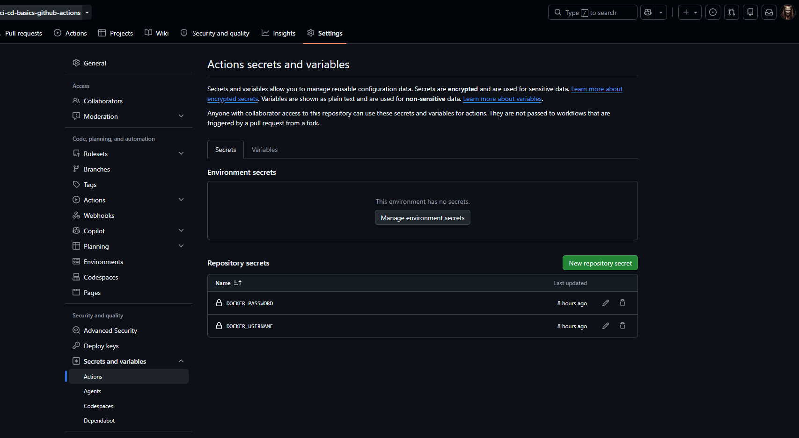
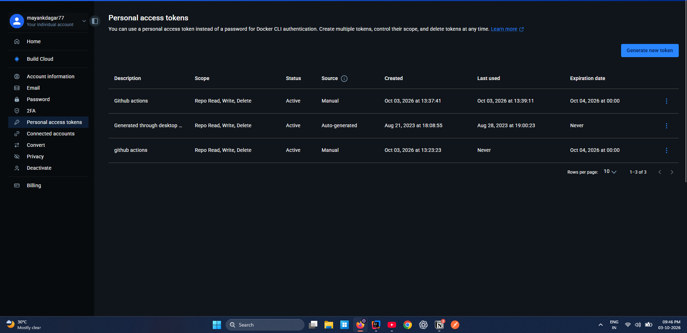

1. Create .github/workflows/deployment.yaml file (any name for deployment file)
2. Set the username, password, token, etc private details using secrets/vars on github actions or for simpler cases use env.
3.  - reference for secrets/vars setup on github
4.  - For DockerHub deployment, get docker hub password/token
5. Once image is pushed to Docker Hub or any Container Registry, just update deployment.yaml with that cloud env details to directly 